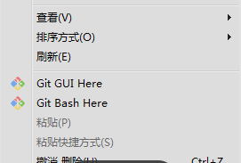
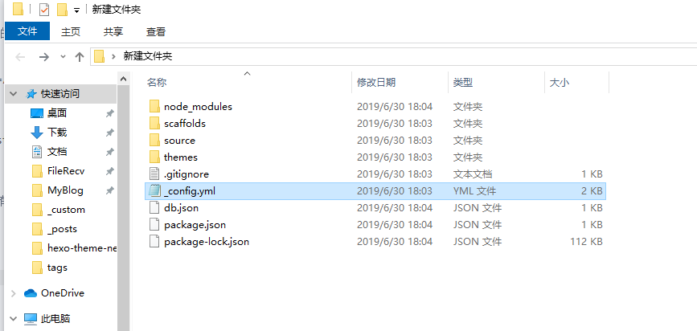
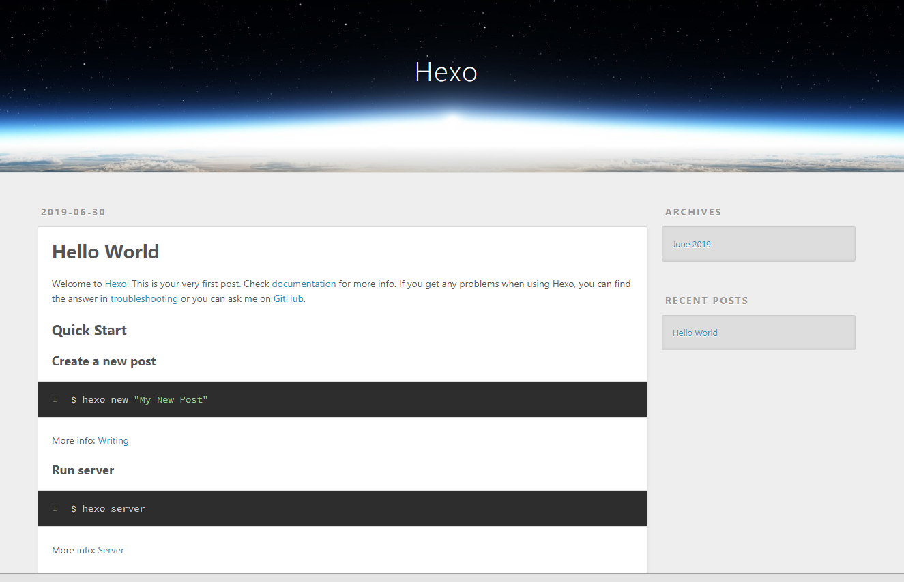
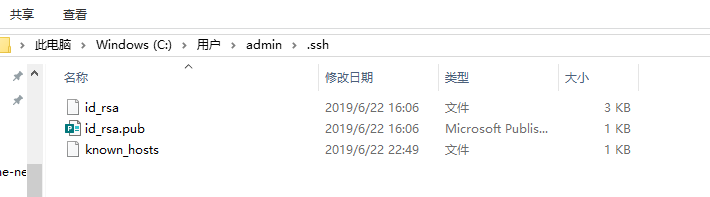
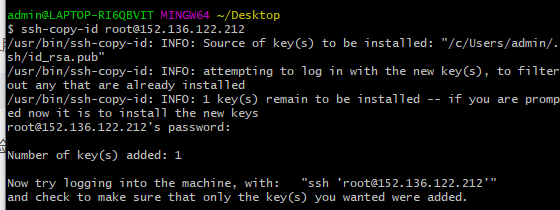

# 利用Hexo快速搭建属于自己的个人博客

>前段时间偶然发现腾讯云的学生优惠，租一年服务器只要120，于是产生了利用云服务器+Hexo来搭建自己的个人博客的想法。但是网上的教程大多是在github上搭建(但github访问速度实在是慢....)，而且对我这种linux新手不是很友好，搭建并不是很顺畅。所以写了这篇博客来记录自己的搭建过程。让我这种之前没有学习过linux，git相关知识的新手，也可以搭建属于自己的个人博客(๑•̀ㅂ•́)و✧

<!-- more -->
## 搭建之前
**因为用Hexo写博客要用markdown格式才可以，没了解过的百度一下markdown基本语法，十分钟就可以搞定啦**

**建议提前上Hexo官网了解一下Hexo的基本用法[Hexo官网](https://hexo.io/zh-cn/docs/)**

搭建和使用过程中会用到一些linux命令，git和vim文本编辑器的使用，这些可以边用边学，看到不懂的命令百度去查就好

## 购买服务器
[腾讯云服务器学生优惠网址](https://cloud.tencent.com/act/campus/buy?value=1)

购买之后还可以以优惠价续费两次，所以足够用到大学毕业，这里推荐直接购买一年，不然会浪费优惠次数。

买的时候选个里自己近的地区就好，操作系统和网络设置默认不用改
## 搭建环境
* 本地环境
  * 系统：windows10
  * 软件环境：`git` ,`Node.js`,`Hexo`,`Xshell`
>git用来把写好的博客上传到服务器上，Hexo用来生成博客，想安装Hexo必须先安装node.js，Xshell用来操作服务器
* 服务器环境
  * 系统：centos
  * 软件环境： `git`,`nginx`
  * 搭建git仓库(比较复杂)
> nginx用来配置web服务器代理，简单来说就是让别人通过访问你的域名就可以看到你写好的博客

## 本地环境配置
### 1、安装git
[git下载网址](https://git-scm.com/)

安装时一路默认配置就可以

安装完对着任意文件夹按右键会有如图的Git Bash Here的选项



### 2、安装Node.js
[Node.js下载网址](http://nodejs.cn/download/)

直接下载windows安装包安装即可

### 3、安装Hexo

在任意位置打开gitbash，输入下面命令,来利用Node.js自带的包管理工具npm来下载Hexo
```shell
npm install hexo-cli hexo-server -g
```
### 4、用hexo初始化博客
在本地新建一个文件夹来存放博客
在新建好的文件夹里右键打开gitbash，输入
```
hexo init
```
博客初始化后文件夹如图所示



在初始化后的文件夹里右键打开git bash输入
```
hexo s
```
然后打开浏览器，打开本地的服务端口网址http://localhost:4000/

如果如图所示说明博客初始化成功



* 现在博客虽然已经在本地搭建成功，但是要想展示给别人则需要把博客上传到服务器上，后面将进行服务器的配置

### 5、安装XShell
[Xshell下载地址](http://www.netsarang.com/download/main.html )

安装完成后打开输入自己服务器的公网ip地址(腾讯云的控制台上可以找到)和root用户的密码来登录服务器。具体操作可以看下面教程
[Xshell使用教程](https://jingyan.baidu.com/article/46650658e9468cf549e5f8b0.html)


## 服务器环境配置
### 1、在服务器上安装git,Node.js和nginx
用Xshell连接上服务器之后，输入以下命令来一键安装这三个软件
```
yum -y install nodejs nginx git
```
安装完可以分别用
```
git --version
nginx -v
node -v
```
来验证是否安装成功

nginx安装成功后，输入`nginx`来开启服务

在本地电脑打开浏览器，网址栏输入服务器的ip地址，如果看到nginx的欢迎界面，则说明开启成功

### 2、git仓库的搭建

#### 2.1、创建一个新用户来运行git服务
*这里推荐先百度学习一下linux的一些基础命令如cd ls chown chmod su touch pwd vim等等*
* 创建git用户
```
adduser git
passwd 你要设置的密码
```
* 配置git用户的权限
```
chmod 740 /etc/sudoers
vim /etc/sudoers
```
* 在vim编辑器中找到以下内容
```
## Allow root to run any commands anywhere
root    ALL=(ALL)       ALL
```
* 在文本最下面添加一行
```
git ALL=(ALL) ALL
```
* 保存并退出，并将权限修改回来
```
chmod 400 /etc/sudoers
```
这样git用户就可以在任意位置使用任意命令啦

*linux中的vim编辑器的使用可以看下面这个教程*
[vim使用教程](https://www.runoob.com/linux/linux-vim.html)


#### 2.2、配置sshkey（以便后面可以免密同步博客文件）
  1. 切换到git用户：
   ```
   su git
   ```

  2. 创建.ssh目录并修改权限：
   ```
   mkdir .ssh && chmod 700 .ssh
   ```

  3. 然后创建authorized_keys公钥保存文件：
   ```
   touch .ssh/authorized_keys && chmod 600 .ssh/authorized_keys
   ```
  4. 此时切换回本地windows端，在任意位置打开git bash输入
   ```
   ssh-keygen -t rsa
   ```
   然后一路回车创建sshkey

   创建好的sshkey默认放在在c盘用户文件夹的.ssh文件夹中

   

   其中`id_rsa`是秘钥文件保存在本地，`id_rsa.pub`是公钥要上传到服务器上


  5. 将创建好的sshkey公钥上传到服务器的git用户上
   
  在git bash上输入
  ```
  ssh-copy-id git@你服务器的公网ip地址
  ```
  回车后会让你输入git用户的密码，复制成功截图如下：
  
     
  *因为我的git用户已经配置过了sshkey，所以这里测试我用的是root用户，大家代码就按上面的敲就好*

  复制成功后在git bash输入
  ```
  ssh git@你服务器的公网ip地址
  ```
  测试能否不输入直接密码登录git用户
#### 2.3创建服务器端的博客根目录
>#后面为注释内容
```  
su root
mkdir /home/hexo  # 以后本地写的博客都会上传到这个目录下
```

修改文件所有权
```
chown git:git -R /home/hexo
```

#### 2.4创建git仓库
```
su root
cd /home/git   # 在 home路径下下创建git文件夹
git init --bare blog.git  #并在此处初始化git仓库
```

然后再修改该git仓库的权限
```
chown git:git -R blog.git
```
#### 2.5修改git-hooks的配置
```
vim blog.git/hooks/post-receive
```
填入下面的内容,其中`/home/hexo`为你博客的根目录，填完退出保存
```
#!/bin/sh
git --work-tree=/home/hexo --git-dir=/home/git/blog.git checkout -f
```
保存后修改该文件的权限
```
chmod +x /home/git/blog.git/hooks/post-receive
```

### 3、配置nginx
* 使用 nginx -t 命令查看配置文件所在位置，一般为 `/etc/nginx/nginx.conf`。

* 使用 `vim /etc/nginx/nginx.conf` 命令进行编辑，找到并修改配置文件如下：
```
server {
    listen       80 default_server;
    listen       [::]:80 default_server;
    server_name  xxxx.com;    # 修改为自己的域名
    root         /home/hexo;    # 修改为网站的根目录

    # Load configuration files for the default server block.
    include /etc/nginx/default.d/*.conf;

    location / {
    }

    error_page 404 /404.html;
        location = /40x.html {
    }

    error_page 500 502 503 504 /50x.html;
        location = /50x.html {
    }
}
```
* 重启nginx服务

```
service nginx restart
```

## 修改本地博客的配置
* 打开本地的博客文件夹，修改_config.yml文件，用记事本打开就好
找到最后面的#Deployment部分,修改为
```
deploy:
    type: git
    repo: git@SERVER:/home/git/blog.git     
    branch: master      
```
*其中SERVE替换为你服务器的公网ip地址*

* 此时在本地的博客文件夹打开git bash，输入

```
hexo d
```
如果到本地文件能正常部署到服务器上，就说明大功告成啦

## 总结
* 博客的搭建步骤大致如下：

1. 在本地端和服务器端分别安装好各自需要的软件环境：Node.js，git，hexo，nginx
2. 在服务器端创建git用户，然后在本地生成ssh-key，并把生成的公钥上传到服务器上，来实现免密登录
3. 在服务器端创建博客文件夹，然后用`git init --bare`来创建接受文件的git仓库，并配置好git-hooks
4. 在本地修改配置文件_comfig.yml来实现通过用`hexo g`命令实现自动将本地博客文件自动上传到服务器上

* Hexo原理简述：
hexo用`hexo g`命令时，会将本地的souse文件夹中的.md文件，根据主题的配置，生成对应博客网站的html和css代码存放在public文件夹中
然后用`hexo d`会将public这个文件夹上传到服务器上，然后通过nginx的反向代理，这样就可以访问到博客的网站

## 博客的使用
* 每次写博客时都用`hexo new post "文章名"`来生成一篇博客，之后会自动生成.md文件
* 文章写好后可以用以下命令
```
hexo clean      //清空之前生成的博客
hexo g          //重新生成博客
hexo s          //开启本地localhost:4000预览
```
* 先在本地预览一下，再用`hexo g`上传到服务器上
* 具体使用还是多上网查下资料，熟悉下hexo的各种命令和配置文件`_config.yml`的配置比较好

> 这样所有的配置就都完成了，
> 剩下的就是博客主题的配置了，可以去官网挑一个喜欢的来用。然后百度该主题的配置方法。这里推荐我正在用的Next主题，比较好看而且网上很好找到该主题的配置方法，极力推荐。
> 把博客部署在服务器上比较复杂，而且绑定域名需要备案，不然就只能通过ip地址来访问
> 如果只是想搭建练下手，可以百度教程Hexo+github的搭建教程，要简单得多。
> 当然也可以不用Hexo框架，据说用WordPress来搭好像更方便些
> 如果搭建中出现什么问题可以qq联系我，共同学习一下~


