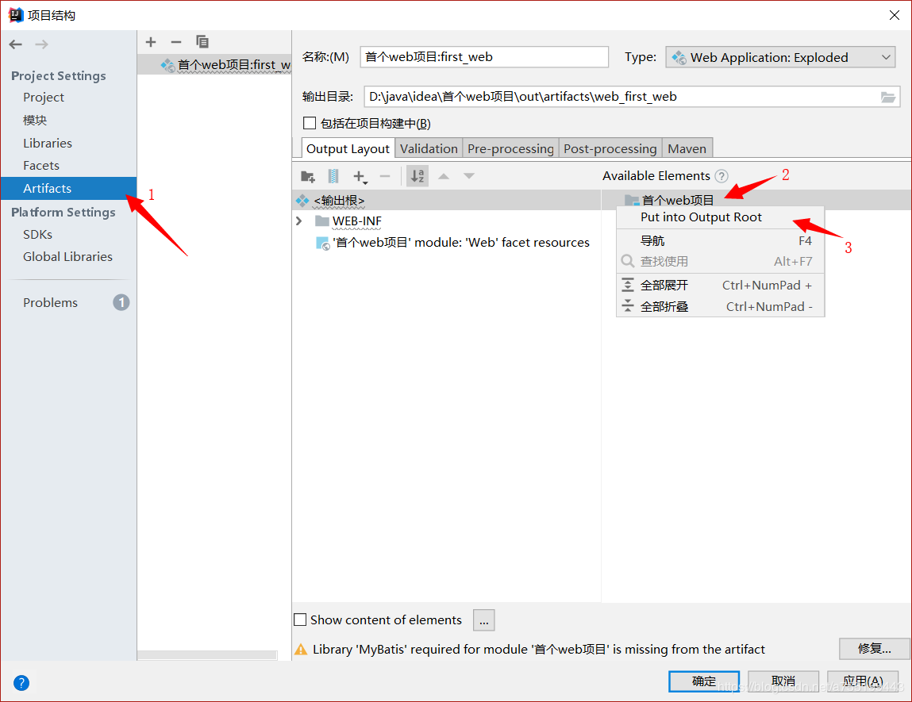
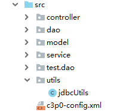

---
title: 记录JavaWeb学习中踩过的坑
date: 2019-07-23 20:12:46
tags:
- JavaWeb
- 踩坑记录
categories:
- JavaWeb
---
初学JavaWeb难免有各种不熟悉的知识，本文记录了自己踩过的一些坑，以作备忘，同时帮助遇到相同问题的朋友们。未完待续....
<!-- more -->

## 在tomcat上运行后提示各种类找不到

解决方法：

* 在idea的web项目中导入的jar包要放在WEB-INF下的lib文件夹中(idea不会自动创建，要自己手动添加)

添加步骤如下：
1. 在Project Structure(ctrl+shift+alt+s)中的Libraries导入
2. 还要在Artifacts中如图导入output root目录中(WEB-INF下的lib文件夹)

[参考链接](https://blog.csdn.net/a755199443/article/details/89192230)

## 提示c3p0找不到配置文件，而使用defult-config

解决方法：

* c3p0的配置文件要放直接在src目录下，不能和jdbcUtils类一起放在utils包中，不然会找不到配置文件

 

## 将.sql文件导入数据库时报错"Unknown collation: 'utf8mb4_unicode_ci"

错误原因：
* 生成数据库的版本高于要导入的数据库版本，旧版本中没有"utfmb4"和`utf8mb4_0900_ai_ci`这两种字符集

解决办法：
1. 将生成的.sql文件中的**每一行**里的`utf8mb4_0900_ai_ci`替换为`utf8_general_ci`,`utf8mb4`替换为`utf8`

